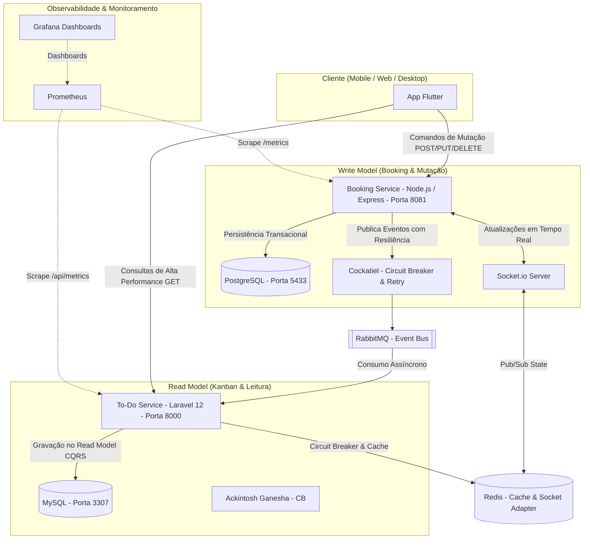

# 🚀 MicroSaaS To-Do & Booking — Arquitetura Distribuída em Microsserviços

Plataforma MicroSaaS para Gerenciamento Kanban e Agendamento de Reuniões utilizando uma arquitetura orientada a eventos (Event-Driven Architecture), CQRS, resiliência avançada (Circuit Breaker & Retry) e observabilidade completa (Prometheus + Grafana).

---

## 📐 Visão Geral da Arquitetura

O ecossistema é dividido em microsserviços independentes para garantir desacoplamento, alta disponibilidade e escalabilidade vertical/horizontal. A comunicação entre os serviços de escrita e leitura ocorre de forma assíncrona com consistência eventual garantida via mensageria.



---

## 🛠️ Tecnologias e Padrões Aplicados

### 1. CQRS (Command Query Responsibility Segregation)

- **Write Model** (`booking-service` — Node.js + TypeScript + PostgreSQL, porta **8081**): único ponto de mutação. Cria, atualiza, move e remove cards do Kanban e agenda reuniões.
- **Read Model** (`todo-service` — Laravel 12 + MySQL + Redis, porta **8000**): **Kanban READ-ONLY**. Expõe apenas `GET` de boards e cards. Não aceita `POST`/`PUT`/`DELETE` de negócio; o estado é projetado a partir dos eventos do RabbitMQ.

### 2. Comunicação Assíncrona & Mensageria (RabbitMQ)

O Booking Service publica eventos nas filas:

| Fila | Origem | Consumidor Laravel |
|---|---|---|
| `reuniao_criada` | Criação de reunião | `php artisan rabbitmq:consume-reuniao-criada` |
| `kanban_events` | `CardCriadoEvent`, `CardAtualizadoEvent`, `CardMovidoEvent`, `CardDeletadoEvent` | `php artisan rabbitmq:consume-kanban-events` |

A idempotência usa o `id` da reunião em `reunioes_read` e o `source_id` (ID do card no Write Model) na tabela `cards`.

### 3. Resiliência e Tolerância a Falhas

- **Circuit Breaker:** Protege a comunicação com a mensageria. Implementado via **Cockatiel** na API de Escrita e via **Ackintosh Ganesha** (Redis) na API de Leitura (interrompe chamadas em caso de taxa de falhas > 50%).
- **Políticas de Retry:** Tentativas automáticas com backoff exponencial na publicação de mensagens.

### 4. Observabilidade & Rastreabilidade Distribuída

- **Rastreabilidade (Correlation ID):** O cabeçalho `X-Correlation-ID` é injetado e repassado em toda a cadeia de chamadas para permitir rastreio de logs ponta-a-ponta entre serviços.
- **Métricas Prometheus & Grafana:** Métricas customizadas de latência, consumo de filas, quantidade de boards/cards ativos e status do sistema.
- **Probes de Saúde:** Endpoints `/health/live` e `/health/ready` compatíveis com orquestração em Kubernetes.

### 5. Interface do Usuário Reativa (Flutter)

- **Optimistic UI:** A interface do aplicativo Flutter é atualizada imediatamente no envio da ação. Caso o backend retorne uma falha, o app realiza um rollback automático.
- **Colaboração em Tempo Real:** WebSockets via Socket.io + Redis Pub/Sub atualizam instantaneamente a tela de outros usuários conectados.

---

## 🗂️ Estrutura de Repositórios

Este repositório atua como o Orquestrador Central da Arquitetura, reunindo os serviços individuais como submódulos Git:

```plaintext
MicroSaas_Architecture/
├── todo-service/                     # 📝 [Laravel 12] Kanban Read Model (GET only)
├── booking-service/                  # 📅 [Node.js + Flutter] Write Model + orquestração
│   └── docker-compose.yml            # 🐳 Stack unificada (Node, Laravel, bancos, RabbitMQ)
└── README.md
```

---

## 🚀 Como Executar o Ecossistema Completo

### Pré-requisitos

- Docker (v24+) e Docker Compose (v2+)
- Git

### Passo 1: Clonar o Repositório com Submódulos

Para clonar este repositório trazendo o código fonte de ambos os microsserviços:

```bash
git clone --recursive https://github.com/Dev-Egito/MicroSaas_Architecture.git
cd MicroSaas_Architecture
```

Caso já tenha clonado sem o `--recursive`, rode:

```bash
git submodule update --init --recursive
```

### Passo 2: Inicializar a Infraestrutura

A orquestração unificada está em `booking-service/docker-compose.yml` (a rede `microsaas-net` é criada pelo Compose).

```bash
cd booking-service
docker compose up -d --build
```

Depois, rode as migrations do Read Model:

```bash
docker compose exec laravel-app php artisan migrate --force
```

Os workers `cqrs_laravel_worker_reuniao` e `cqrs_laravel_worker_kanban` sobem junto da stack e consomem `reuniao_criada` e `kanban_events`.

---

## 📊 Mapeamento de Portas e Endereços

| Serviço / Dashboard        | Tecnologia         | Porta Host  | URL / Descrição                              |
|-----------------------------|---------------------|-------------|-----------------------------------------------|
| API Booking (Write Model)   | Node.js / Express   | 8081        | http://localhost:8081 — POST/PUT/DELETE        |
| API Kanban (Read Model)     | Laravel 12 / Nginx  | 8000        | http://localhost:8000 — apenas GET             |
| Swagger UI (Kanban)         | L5-Swagger          | 8000        | http://localhost:8000/api/documentation        |
| Swagger UI (Booking)        | Swagger UI          | 8081        | http://localhost:8081/api/docs                 |
| RabbitMQ Management         | RabbitMQ 3          | 15672       | http://localhost:15672 (guest/guest)           |
| Prometheus Metrics          | Prometheus          | 9090        | http://localhost:9090                          |
| Grafana Dashboards          | Grafana             | 3000        | http://localhost:3000 (admin/admin)            |
| Banco MySQL (Read)          | MySQL 8.0           | 3307        | Banco de dados de Leitura                      |
| Banco Postgres (Write)      | PostgreSQL 15       | 5433        | Banco de dados de Escrita                      |
| Cache & Sub/Pub             | Redis 7             | 6379        | Cache global e estado de Circuit Breakers      |

> **CQRS no cliente:** o Flutter envia mutações para `localhost:8081` e consultas Kanban para `localhost:8000`. Isolated `todo-service/php-service/docker-compose.yaml` ainda mapeia o Nginx do Laravel em `8081` — use apenas um dos Compose por vez para evitar conflito de portas.

---

## 👥 Autoria e Desenvolvimento

Projeto desenvolvido de forma colaborativa como trabalho prático para a disciplina de **Tópicos Avançados em Computação (TAC)**.

Todos os membros participaram ativamente em todas as etapas do ecossistema, incluindo definição da arquitetura de microsserviços, implementação de serviços (Laravel, Node.js e Flutter), orquestração de infraestrutura (Docker, Kubernetes, mensageria e observabilidade) e documentação.

- Allan Xavier
- Matheus Egito
- Murilo

---

**Licença MIT** — Livre para fins de estudo e portfólio.